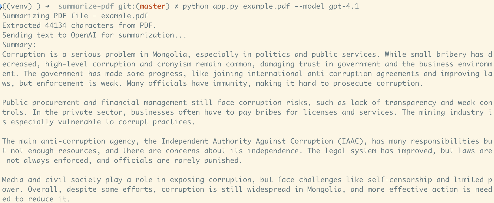

# Summarize PDF file
A Python CLI application that summarizes the contents of a given PDF file using OpenAI's API.

## How to use
```shell
> pip install -r requirements.txt
> export OPENAI_API_KEY=<your-key>
> python app.py example.pdf
```

## Example output

After running the command, you will get a summary and an output image:

